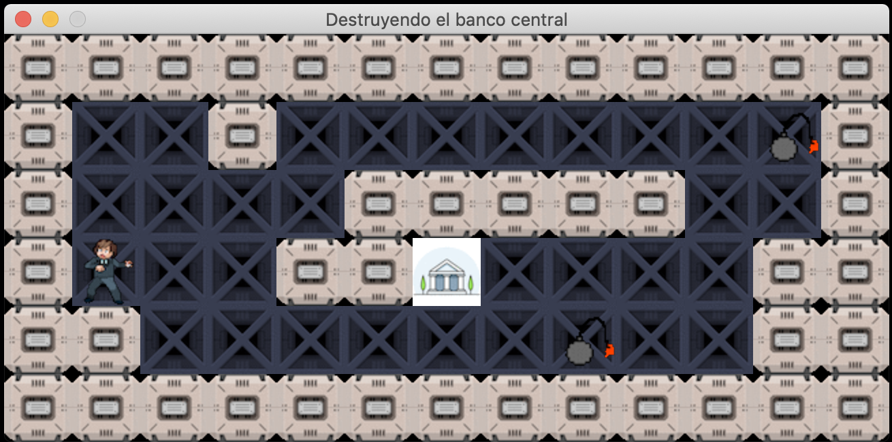

# `So_long`

A 2D graphic game with MinilibX.

[Subject](en.subject.pdf)




## Installation & Usage

Clone this repository to your computer:
```sh
git clone https://github.com/MatPizzolo/Solong.git
```

First compile and install library
```sh
make
```

Run the game with a specific map file as argument.
```
./so_long "maps/first.ber"
```


## How to play
### Rule
Control your character to collect all items in the map and reach the exit.

### Key control
You can control the main character with the specific keys below.

|Key|Description|
|--|--|
| `A` | Walk Left|
| `W` | Walk Up|
| `S` | Walk Down|
| `D` | Walk Right|
| `Esc`| Exit Game |


### Map File
You can create your own map file as you like but need to follow these rules.
- map is covered with walls
- map is contained with 1 item, 1 player and 1 exit door.
- The map must be rectangular
- map file name need end with `.ber`
- place map file in `maps` directory

The character is defined in file follow like these
| Character |Description|
|--|--|
| `0` | Free space |
| `1` | Wall |
| `P` | Player |
| `E` | Exit door |
| `C` | Collectable item |

**Map file example**
```txt
1111111111111
100100010C001
10010100000C1
100C011111001
1P0011E000001
1111111111111
```

## Resources
- [MiniLibX]
- [MiniLibX Documentation]
- [MiniLibX Tutorial]
- [MiniLibX Example]


<!-- MARKDOWN LINKS -->
[Watch full demo]: https://www.youtube.com/watch?v=uNdFxDJdcTA
[MiniLibX]: https://github.com/42Paris/minilibx-linux
[MiniLibX Documentation]: https://harm-smits.github.io/42docs/libs/minilibx/introduction.html
[MiniLibX Tutorial]: https://aurelienbrabant.fr/blog/pixel-drawing-with-the-minilibx
[MiniLibX Example]: https://github.com/terry-yes/mlx_example
